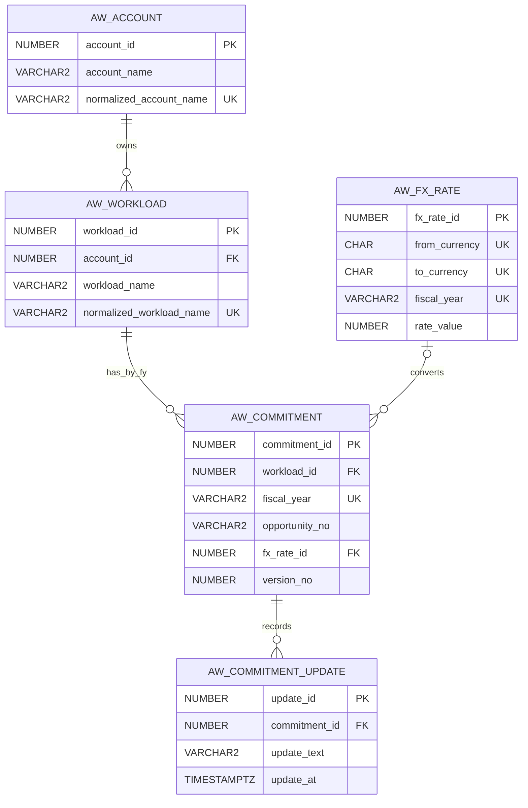

# Accounts & Workloads Oracle Compact 설계

> 모델: Compact 5-table
> 대상 DB: Oracle Autonomous Database
> 기준: FY27 Excel 검증 통과 및 ADB 적재 26행

## 1. 설계 결정

### 유지하는 테이블

| 테이블 | 책임 |
|---|---|
| `AW_ACCOUNT` | Account identity와 정규화명 중복 방지 |
| `AW_WORKLOAD` | Account 하위 Workload identity와 중복 방지 |
| `AW_COMMITMENT` | FY별 화면 한 행, Opportunity/Plan/날짜/금액/Target/상태/메모 |
| `AW_FX_RATE` | USD/KRW 환산 provenance |
| `AW_COMMITMENT_UPDATE` | Latest Update append-only 이력 |

### 제거·통합

- `AW_OPPORTUNITY`: 독립 lifecycle이 없어 `AW_COMMITMENT.opportunity_no`로 통합
- `AW_PERSON`: 현재 독립 담당자 UI가 없어 감사 actor 문자열로 대체
- `AW_CODE`: 작은 enum은 CHECK + 애플리케이션 enum
- `AW_FISCAL_PERIOD`: FY/Quarter 컬럼과 서비스 달력 규칙
- `AW_LOAD_BATCH`: workbook hash/sheet/row provenance 컬럼으로 대체

## 2. 관계



- Account 1:N Workload
- Workload 1:N Commitment, 단 `(workload_id, fiscal_year)` unique
- FX Rate 0..1:N Commitment
- Commitment 1:N Update

Opportunity 번호는 여러 FY Commitment에 반복될 수 있으므로 전역 UK를 두지 않고 비고유 검색 인덱스만 사용한다. Fiscal Period 테이블을 제거한 대신 현재 UI에 구현된 회계 달력(FY 시작 6월 1일)의 계산 결과를 `target_period_end_date`에 함께 저장한다. 회계 달력을 DB 기준정보로 독립 관리해야 하는 요구가 생기면 6번째 `AW_FISCAL_PERIOD` 테이블을 재도입한다.

## 3. Oracle DDL

다음 DDL이 실제 배포 기준이다. 객체명은 모두 30 byte 이하이며 Oracle `DATE`, `TIMESTAMP WITH TIME ZONE`, `NUMBER`, identity column을 사용한다.

```sql
CREATE TABLE aw_account (
    account_id NUMBER GENERATED BY DEFAULT ON NULL AS IDENTITY,
    account_name VARCHAR2(200 CHAR) NOT NULL,
    normalized_account_name VARCHAR2(200 CHAR) NOT NULL,
    created_at TIMESTAMP WITH TIME ZONE DEFAULT SYSTIMESTAMP NOT NULL,
    created_by VARCHAR2(200 CHAR) NOT NULL,
    updated_at TIMESTAMP WITH TIME ZONE DEFAULT SYSTIMESTAMP NOT NULL,
    updated_by VARCHAR2(200 CHAR) NOT NULL,
    version_no NUMBER(10) DEFAULT 1 NOT NULL,
    deleted_at TIMESTAMP WITH TIME ZONE,
    deleted_by VARCHAR2(200 CHAR),
    CONSTRAINT aw_account_pk PRIMARY KEY (account_id),
    CONSTRAINT aw_account_uk1 UNIQUE (normalized_account_name),
    CONSTRAINT aw_account_ck1 CHECK (version_no >= 1),
    CONSTRAINT aw_account_ck2 CHECK (
        (deleted_at IS NULL AND deleted_by IS NULL) OR
        (deleted_at IS NOT NULL AND deleted_by IS NOT NULL)
    )
);

CREATE TABLE aw_workload (
    workload_id NUMBER GENERATED BY DEFAULT ON NULL AS IDENTITY,
    account_id NUMBER NOT NULL,
    workload_name VARCHAR2(300 CHAR) NOT NULL,
    normalized_workload_name VARCHAR2(300 CHAR) NOT NULL,
    created_at TIMESTAMP WITH TIME ZONE DEFAULT SYSTIMESTAMP NOT NULL,
    created_by VARCHAR2(200 CHAR) NOT NULL,
    updated_at TIMESTAMP WITH TIME ZONE DEFAULT SYSTIMESTAMP NOT NULL,
    updated_by VARCHAR2(200 CHAR) NOT NULL,
    version_no NUMBER(10) DEFAULT 1 NOT NULL,
    deleted_at TIMESTAMP WITH TIME ZONE,
    deleted_by VARCHAR2(200 CHAR),
    CONSTRAINT aw_workload_pk PRIMARY KEY (workload_id),
    CONSTRAINT aw_workload_fk1 FOREIGN KEY (account_id)
        REFERENCES aw_account (account_id),
    CONSTRAINT aw_workload_uk1 UNIQUE (account_id, normalized_workload_name),
    CONSTRAINT aw_workload_ck1 CHECK (version_no >= 1),
    CONSTRAINT aw_workload_ck2 CHECK (
        (deleted_at IS NULL AND deleted_by IS NULL) OR
        (deleted_at IS NOT NULL AND deleted_by IS NOT NULL)
    )
);

CREATE TABLE aw_fx_rate (
    fx_rate_id NUMBER GENERATED BY DEFAULT ON NULL AS IDENTITY,
    from_currency CHAR(3 CHAR) NOT NULL,
    to_currency CHAR(3 CHAR) NOT NULL,
    fiscal_year VARCHAR2(4 CHAR) NOT NULL,
    rate_value NUMBER(20,8) NOT NULL,
    effective_from DATE,
    effective_to DATE,
    source_code VARCHAR2(30 CHAR) NOT NULL,
    source_reference VARCHAR2(200 CHAR),
    created_at TIMESTAMP WITH TIME ZONE DEFAULT SYSTIMESTAMP NOT NULL,
    created_by VARCHAR2(200 CHAR) NOT NULL,
    updated_at TIMESTAMP WITH TIME ZONE DEFAULT SYSTIMESTAMP NOT NULL,
    updated_by VARCHAR2(200 CHAR) NOT NULL,
    version_no NUMBER(10) DEFAULT 1 NOT NULL,
    CONSTRAINT aw_fx_rate_pk PRIMARY KEY (fx_rate_id),
    CONSTRAINT aw_fx_rate_uk1 UNIQUE (from_currency, to_currency, fiscal_year),
    CONSTRAINT aw_fx_rate_uk2 UNIQUE (fx_rate_id, fiscal_year),
    CONSTRAINT aw_fx_rate_ck1 CHECK (from_currency <> to_currency),
    CONSTRAINT aw_fx_rate_ck2 CHECK (rate_value > 0),
    CONSTRAINT aw_fx_rate_ck3 CHECK (REGEXP_LIKE(fiscal_year, '^FY[0-9]{2}$')),
    CONSTRAINT aw_fx_rate_ck4 CHECK (
        effective_from IS NULL OR effective_to IS NULL OR effective_to >= effective_from
    ),
    CONSTRAINT aw_fx_rate_ck5 CHECK (version_no >= 1)
);

CREATE TABLE aw_commitment (
    commitment_id NUMBER GENERATED BY DEFAULT ON NULL AS IDENTITY,
    workload_id NUMBER NOT NULL,
    fiscal_year VARCHAR2(4 CHAR) NOT NULL,
    plan_number VARCHAR2(100 CHAR),
    opportunity_no VARCHAR2(400 CHAR),
    start_date DATE,
    end_date DATE,
    arr_usd NUMBER(20,2),
    arr_krw NUMBER(20,0),
    arr_source_currency VARCHAR2(8 CHAR),
    acr_usd NUMBER(20,2),
    acr_krw NUMBER(20,0),
    acr_source_currency VARCHAR2(8 CHAR),
    fx_rate_id NUMBER,
    target_fiscal_year VARCHAR2(4 CHAR),
    target_quarter VARCHAR2(2 CHAR),
    target_period_end_date DATE,
    win_probability NUMBER(5,2),
    status_code VARCHAR2(20 CHAR) DEFAULT 'TRACKING' NOT NULL,
    commitment_type_code VARCHAR2(20 CHAR) DEFAULT 'UNCLASSIFIED' NOT NULL,
    is_important CHAR(1 CHAR) DEFAULT 'N' NOT NULL,
    notes VARCHAR2(4000 CHAR),
    source_workbook_hash CHAR(64 CHAR) NOT NULL,
    source_sheet VARCHAR2(128 CHAR) NOT NULL,
    source_row_number NUMBER(10) NOT NULL,
    created_at TIMESTAMP WITH TIME ZONE DEFAULT SYSTIMESTAMP NOT NULL,
    created_by VARCHAR2(200 CHAR) NOT NULL,
    updated_at TIMESTAMP WITH TIME ZONE DEFAULT SYSTIMESTAMP NOT NULL,
    updated_by VARCHAR2(200 CHAR) NOT NULL,
    version_no NUMBER(10) DEFAULT 1 NOT NULL,
    deleted_at TIMESTAMP WITH TIME ZONE,
    deleted_by VARCHAR2(200 CHAR),
    CONSTRAINT aw_commitment_pk PRIMARY KEY (commitment_id),
    CONSTRAINT aw_commitment_fk1 FOREIGN KEY (workload_id)
        REFERENCES aw_workload (workload_id),
    CONSTRAINT aw_commitment_fk2 FOREIGN KEY (fx_rate_id, fiscal_year)
        REFERENCES aw_fx_rate (fx_rate_id, fiscal_year),
    CONSTRAINT aw_commitment_uk1 UNIQUE (workload_id, fiscal_year),
    CONSTRAINT aw_commitment_uk2 UNIQUE (
        source_workbook_hash, source_sheet, source_row_number
    ),
    CONSTRAINT aw_commitment_ck1 CHECK (REGEXP_LIKE(fiscal_year, '^FY[0-9]{2}$')),
    CONSTRAINT aw_commitment_ck2 CHECK (
        start_date IS NULL OR end_date IS NULL OR end_date >= start_date
    ),
    CONSTRAINT aw_commitment_ck3 CHECK (
        arr_usd IS NULL OR arr_usd >= 0
    ),
    CONSTRAINT aw_commitment_ck4 CHECK (
        arr_krw IS NULL OR arr_krw >= 0
    ),
    CONSTRAINT aw_commitment_ck5 CHECK (
        acr_usd IS NULL OR acr_usd >= 0
    ),
    CONSTRAINT aw_commitment_ck6 CHECK (
        acr_krw IS NULL OR acr_krw >= 0
    ),
    CONSTRAINT aw_commitment_ck7 CHECK (
        (arr_usd IS NULL AND arr_krw IS NULL AND arr_source_currency IS NULL) OR
        (arr_source_currency = 'USD' AND arr_usd IS NOT NULL) OR
        (arr_source_currency = 'KRW' AND arr_krw IS NOT NULL) OR
        (arr_source_currency = 'MIGRATED' AND
         (arr_usd IS NOT NULL OR arr_krw IS NOT NULL))
    ),
    CONSTRAINT aw_commitment_ck8 CHECK (
        (acr_usd IS NULL AND acr_krw IS NULL AND acr_source_currency IS NULL) OR
        (acr_source_currency = 'USD' AND acr_usd IS NOT NULL) OR
        (acr_source_currency = 'KRW' AND acr_krw IS NOT NULL) OR
        (acr_source_currency = 'MIGRATED' AND
         (acr_usd IS NOT NULL OR acr_krw IS NOT NULL))
    ),
    CONSTRAINT aw_commitment_ck9 CHECK (
        (target_fiscal_year IS NULL AND target_quarter IS NULL AND
         target_period_end_date IS NULL) OR
        (REGEXP_LIKE(target_fiscal_year, '^FY[0-9]{2}$') AND
         target_quarter IN ('Q1','Q2','Q3','Q4') AND
         target_period_end_date IS NOT NULL)
    ),
    CONSTRAINT aw_commitment_ck10 CHECK (
        win_probability IS NULL OR win_probability BETWEEN 0 AND 100
    ),
    CONSTRAINT aw_commitment_ck11 CHECK (
        status_code IN ('TRACKING','ON_HOLD','WON','LOST','CLOSED')
    ),
    CONSTRAINT aw_commitment_ck12 CHECK (
        commitment_type_code IN (
            'UNCLASSIFIED','NEW','RENEWAL','EXPAND','RENEWAL_EXPAND'
        )
    ),
    CONSTRAINT aw_commitment_ck13 CHECK (is_important IN ('Y','N')),
    CONSTRAINT aw_commitment_ck14 CHECK (version_no >= 1),
    CONSTRAINT aw_commitment_ck15 CHECK (source_row_number > 0),
    CONSTRAINT aw_commitment_ck16 CHECK (
        (deleted_at IS NULL AND deleted_by IS NULL) OR
        (deleted_at IS NOT NULL AND deleted_by IS NOT NULL)
    )
);

CREATE TABLE aw_commitment_update (
    update_id NUMBER GENERATED BY DEFAULT ON NULL AS IDENTITY,
    commitment_id NUMBER NOT NULL,
    update_text VARCHAR2(4000 CHAR) NOT NULL,
    update_at TIMESTAMP WITH TIME ZONE DEFAULT SYSTIMESTAMP NOT NULL,
    update_by VARCHAR2(200 CHAR) NOT NULL,
    source_workbook_hash CHAR(64 CHAR),
    source_sheet VARCHAR2(128 CHAR),
    source_row_number NUMBER(10),
    created_at TIMESTAMP WITH TIME ZONE DEFAULT SYSTIMESTAMP NOT NULL,
    CONSTRAINT aw_commitment_update_pk PRIMARY KEY (update_id),
    CONSTRAINT aw_commitment_update_fk1 FOREIGN KEY (commitment_id)
        REFERENCES aw_commitment (commitment_id),
    CONSTRAINT aw_commitment_update_ck1 CHECK (
        source_row_number IS NULL OR source_row_number > 0
    )
);

CREATE INDEX aw_commitment_ix1
    ON aw_commitment (fiscal_year, deleted_at, workload_id);
CREATE INDEX aw_commitment_ix2
    ON aw_commitment (fiscal_year, deleted_at, end_date);
CREATE INDEX aw_commitment_ix3
    ON aw_commitment (
        fiscal_year, deleted_at, target_period_end_date,
        target_fiscal_year, target_quarter
    );
CREATE INDEX aw_commitment_ix4
    ON aw_commitment (fiscal_year, deleted_at, is_important);
CREATE INDEX aw_commitment_ix5 ON aw_commitment (plan_number);
CREATE INDEX aw_commitment_ix6 ON aw_commitment (opportunity_no);
CREATE INDEX aw_commitment_update_ix1
    ON aw_commitment_update (commitment_id, update_at DESC, update_id DESC);
```

## 4. Excel 컬럼 매핑

| Excel | Compact 컬럼 | 변환 |
|---|---|---|
| `Plan Number` | `plan_number` | trim |
| `Accounts` | Account master | trim + 명시적 normalized key |
| `Workload Name(Enduser)` | Workload master | trim + 명시적 normalized key + Account 하위 unique |
| `Oppty.No` | `opportunity_no` | 원문 보존 |
| `Start Date` | `start_date` | Excel date → Oracle `DATE` |
| `End Date` | `end_date` | Excel date → Oracle `DATE` |
| `ARR($)`/`ARR(\)` | ARR 컬럼 | Formula 방향으로 source currency 판정 |
| `ACR($)`/`ACR(\)` | ACR 컬럼 | Formula 방향으로 source currency 판정 |
| `Target` | Target FY/Quarter/period end | `FYnn Qn` split + 기존 UI 회계달력으로 quarter end 계산 |
| `Win Prob.` | `win_probability` | Excel `1` + `0%` → `100` |
| `Status Update` | Update child | nonblank 행만 append |
| 헤더 없는 O열 | `notes` | 값 1건을 기존 UI 의미에 따라 Notes로 원문 보존; source lineage 유지 |
| `Exchange Rate` P3 | FX Rate | USD/KRW FY27 1건 |
| 노란색 채움 | `is_important` | Account/Workload/Oppty 셀 yellow이면 `Y` |
| Workbook/Sheet/Row | provenance | SHA-256, `Deal Status`, Excel row |

`fiscal_year='FY27'`, `status_code='TRACKING'`, `commitment_type_code='UNCLASSIFIED'`는 source scope/default다. Commitment 유형은 날짜나 Update 문장에서 추론하지 않는다. Target quarter end는 현재 애플리케이션 규칙과 동일하게 FY Q1/Q2/Q3/Q4를 각각 8월/11월/2월/5월 말일로 계산한다.

## 5. Migration 트랜잭션

1. Dry-run에서 오류 행을 제외한다.
2. `AW_FX_RATE` 1건을 생성한다.
3. normalized Account key 순으로 Account를 생성한다.
4. Account FK를 조회해 Workload를 생성한다.
5. Workload와 FX FK를 조회해 Commitment를 생성한다.
6. nonblank Status Update를 child row로 append한다.
7. 전체 DML은 단일 PL/SQL block에서 수행하고 마지막에만 `COMMIT`한다.
8. 예외 시 `ROLLBACK` 후 오류를 재발생시킨다.
9. 재실행은 source provenance unique constraint와 사전 건수 검사로 차단한다.

`normalized_account_name`과 `normalized_workload_name`은 import/API가 `UPPER` + trim + 연속 공백 1칸 규칙으로 생성한다. Oracle virtual column의 함수 제약에 의존하지 않고, API validation과 UK constraint를 함께 사용한다.

Oracle DDL은 auto-commit이므로 각 CREATE 뒤 객체 상태를 확인한다. 실패 시 이번 실행에서 새로 만든 객체만 역순 제거하는 rollback이 필요하다.

## 6. 조회 및 집계 쿼리

### KPI

```sql
SELECT COUNT(DISTINCT w.account_id) AS active_accounts,
       COUNT(*) AS active_workloads,
       ROUND(SUM(NVL(c.arr_usd,0)),2) AS arr_usd,
       ROUND(SUM(NVL(c.acr_usd,0)),2) AS acr_usd,
       SUM(CASE WHEN c.is_important='Y' THEN 1 ELSE 0 END) AS important,
       SUM(CASE WHEN c.target_fiscal_year IS NOT NULL THEN 1 ELSE 0 END) AS targeted
  FROM aw_commitment c
  JOIN aw_workload w ON w.workload_id=c.workload_id
  JOIN aw_account a ON a.account_id=w.account_id
 WHERE c.fiscal_year=:fiscal_year
   AND c.deleted_at IS NULL
   AND w.deleted_at IS NULL
   AND a.deleted_at IS NULL;
```

### Account Portfolio

```sql
SELECT a.account_id,
       COUNT(*) AS workloads,
       ROUND(SUM(NVL(c.arr_usd,0)),2) AS arr_usd,
       ROUND(SUM(NVL(c.acr_usd,0)),2) AS acr_usd,
       SUM(CASE WHEN c.target_fiscal_year IS NOT NULL THEN 1 ELSE 0 END) AS targeted,
       SUM(CASE WHEN c.is_important='Y' THEN 1 ELSE 0 END) AS important
  FROM aw_account a
  JOIN aw_workload w ON w.account_id=a.account_id AND w.deleted_at IS NULL
  JOIN aw_commitment c ON c.workload_id=w.workload_id AND c.deleted_at IS NULL
 WHERE a.deleted_at IS NULL
   AND c.fiscal_year=:fiscal_year
 GROUP BY a.account_id;
```

### Latest Update

```sql
SELECT update_id, commitment_id, update_text, update_at, update_by
  FROM (
        SELECT u.*,
               ROW_NUMBER() OVER (
                   PARTITION BY commitment_id
                   ORDER BY update_at DESC, update_id DESC
               ) AS rn
          FROM aw_commitment_update u
       )
 WHERE rn=1;
```

## 7. PATCH 규칙

- payload에 실제 존재하는 allow-listed 컬럼만 `SET`에 포함한다.
- 미전달과 명시적 NULL을 구분한다.
- `WHERE commitment_id=:id AND version_no=:old_version AND deleted_at IS NULL`.
- 성공 시 `version_no+1`, 감사 시각/actor 갱신.
- 0행이면 HTTP 409 `VERSION_CONFLICT`.
- 금액/FX provenance와 Target pair는 원자적으로 검증한다.
- Latest Update는 child INSERT + parent version bump를 한 트랜잭션으로 수행한다.

## 8. 검증 기준

- Table 5개
- PK 5개, FK 4개, UK 6개, CHECK 26개
- 명시적 비고유 Index 7개
- 모든 constraint `ENABLED` + `VALIDATED`
- Account 8, Workload 26, Commitment 26, FX 1, Update 25
- orphan FK 0
- Workload/FY duplicate 0
- source provenance duplicate 0
- ARR USD 1,447,659.34 / ARR KRW 2,180,319,712
- ACR USD 1,396,677.03 / ACR KRW 2,103,535,250
- FY27 Target 6, FY26 Target 2, Target NULL 18
- Important 5, Win Probability nonnull 2

## 9. 승인 경계와 후속 작업

이번 범위에서 구현한 Backend API와 JET local 연동은 아래 11절에 기술한다. 다음은 별도 승인/후속 구현이 필요하다.

- 애플리케이션 사용자/GRANT
- Change Log/Auditing 확장
- Production purge
- CI/CD/Kubernetes/네트워크 변경
- ADB write smoke test
- Commit/Push/PR

## 10. 배포 상태와 백엔드 영향

2026-08-07 `MYORACLE`에 Compact DDL과 FY27 검증 데이터를 배포했다.

- Table 5, 명시적 Index 7, PK/FK/UK/CHECK = 5/4/6/26
- Account/Workload/FX/Commitment/Update = 8/26/1/26/25
- 전체 constraint ENABLED/VALIDATED, invalid object 0
- 화면용 FY27 joined row 26, Latest Update 25
- KPI와 Account Portfolio 합계가 DB 원본 합계와 일치

Spring Boot는 `adb` profile, Oracle JDBC/UCP, Wallet, `oraclepki` runtime으로 실제 readiness `UP`을 확인했다. 다음 구현은 현재 DDL을 baseline으로 삼아 entity/repository보다 먼저 조회 API 계약(list/search/sort/filter, dashboard projection)을 고정하고, 그 뒤 PATCH·append update·soft delete/restore·FX apply를 `version_no` 규칙에 맞춰 추가한다.

초기 적재용 `AW_LOAD_BATCH_V1` 함수는 현재 DB에 남아 있으나 empty-table guard 때문에 재적재되지 않으며 Managed MCP Tool로 등록되지 않았다. DROP은 삭제 작업이므로 별도 승인 후 수행한다.

## 11. JET ↔ API 연동 설계

- `accountsWorkloadsApi.ts`가 목록/생성/PATCH/삭제/dashboard REST 계약과 DTO 정규화를 담당한다.
- App이 FY별 saved row를 소유하고 Accounts & Workloads 상세와 Home 통계가 동일 saved state를 사용한다.
- 상세 페이지는 `rows`와 `draftRows`를 분리한다. Save 시 신규 row는 POST, 기존 row는 saved/draft field diff만 PATCH, 삭제 draft는 DELETE로 전송한다.
- API row는 `commitmentId`, `versionNo`를 보존한다. 409 발생 시 자동 덮어쓰지 않고 재조회 필요 상태를 사용자에게 알린다.
- 목록 FY·검색·정렬·Include deleted는 서버 query로 재조회한다. 편집 중에는 query control을 disable하여 Save/Cancel 전에 draft가 유실되지 않게 한다.
- loopback 개발 환경의 fetch transport 실패 또는 endpoint 404만 local fallback을 허용하고, 인증·서버·JSON decode·row validation 오류는 명시적 error banner로 표시한다.
- multi-row save는 변경이 있는 row만 operation queue에 넣는다. 부분 성공 시 authoritative 목록을 재조회하여 아직 실패한 field diff만 retry draft에 overlay하고, refresh 실패 시에도 성공 mutation 응답을 합성 상태에 반영해 중복 POST/PATCH/DELETE를 방지한다.
- Home 통계는 mutation 성공 뒤 목록 API에서 재조회한 공용 saved rows로 계산해 상세와 일치시킨다. Dashboard summary endpoint/adapter는 제공하지만 현재 Home의 직접 데이터 소스는 아니다.
- loading/error/empty 상태를 구분하고, 실제 고객 payload는 로그나 Git fixture로 복제하지 않는다.

## 12. 저장·삭제·복원 UX 및 API

- 저장 작업은 중앙 소형 `oj-dialog` + indeterminate `oj-progress-circle`로 표시한다. JET public component API와 Redwood token만 사용하며 내부 DOM class를 override하지 않는다.
- Notes 셀은 `pre-wrap`, `overflow-wrap:anywhere`, 4-line clamp를 적용해 내용은 줄바꿈하되 행과 테이블 영역을 무한 확장하지 않는다.
- 선택 행이 active이면 삭제 버튼은 Draft 삭제를 staging하고, 이미 soft-deleted이면 같은 버튼이 완전 삭제 경고 dialog를 연다. active/deleted 혼합 선택에서는 각각 Draft 삭제/완전 삭제로 분기한다.
- Restore는 `POST /api/v1/accounts-workloads/{id}/restore?versionNo=n`, 완전 삭제는 `DELETE /api/v1/accounts-workloads/{id}/permanent?versionNo=n` 계약을 사용한다.
- 완전 삭제는 soft-deleted Commitment에만 허용하고 Update child를 먼저 제거한 뒤 Commitment를 한 transaction에서 제거한다. 공유 Account/Workload master는 삭제하지 않는다.
- 선택 ID는 draft 편집·Draft 삭제·Restore 동안 유지하며 authoritative Save 성공 뒤에만 초기화한다.

## 13. Tailnet 배포 화면 검증
- `web/`은 현재 `127.0.0.1:8123` 정적 서버가 제공하고 Tailscale Serve `:8443`이 `/`를 프록시한다.
- Notes는 셀과 내부 span 모두 `overflow:hidden`, `overflow-wrap:anywhere`, `word-break:break-word`, `white-space:pre-wrap`, 4-line clamp를 적용한다.
- 저장 dialog는 조건부 마운트하지 않고 `initialVisibility="hide"`로 상시 마운트하며 `saving` 상태에 따라 JET `open()/close()`를 호출한다.
- 최종 검증은 빌드 산출물 존재 확인에 그치지 않고 Tailnet HTTPS 실제 DOM·computed style·dialog open 상태를 측정한다.

## 14. History routing 및 SPA fallback
- Oracle JET VDOM의 화면 상태는 `navigationRoutes.ts`의 route ID/path 매핑을 단일 기준으로 사용한다. Accounts & Workloads canonical path는 `/accounts-workloads`다.
- 앱 부팅 시 `window.location.pathname`을 route로 해석하고, 메뉴 이동은 `history.pushState`, 뒤로·앞으로 이동은 `popstate`로 동기화한다.
- 기존 hash 링크는 최초 부팅 때 canonical history path로 `replaceState`하여 호환한다.
- History routing을 선택한 이유는 사용자가 읽을 수 있는 직접 URL을 제공하고 브라우저 navigation semantics를 보존하기 위해서다. Hash routing은 서버 fallback이 불가능할 때의 대안이지만, 현재 loopback 정적 서버를 통제할 수 있어 사용하지 않는다.
- `src/index.html`의 `<base href="/">`가 직접 하위 경로 접속 시 JS/CSS를 root-relative로 해석하게 한다.
- `scripts/spa_server.py`는 존재하지 않는 extensionless 경로만 `/index.html`로 fallback하고 `.js` 등 누락 asset은 404를 유지한다. Tailscale Serve `:8443 /`는 이 loopback 서버를 그대로 프록시한다.

## Accounts & Workloads UX 보완 설계 (2026-08-13)

### Navigation

- 실제 Tailnet에서 `oj-navigation-list`의 `selection=accounts-workloads`와 Sliding 내부 헤더 `Home`이 불일치했다. History path에서 leaf selection을 초기 주입하는 최근 변경이 JET 내부 drill stack 전환을 유발하므로 History API·path mapping·SPA fallback만 원복한다.
- 기존 `NavigationEntry`의 hash href와 component state route 전환을 복원한다. 정적 서비스는 일반 static server로 복귀하며 `/accounts-workloads` 직접 진입은 제공하지 않고 root에서 메뉴를 선택한다. 새로고침은 Home으로 복귀한다.

### Destructive actions

- 상단 액션은 `Delete` 단일 라벨이다. `resolveDeleteMode`가 active/draft-deleted/mixed를 판정한다.
- active는 draft state에 soft delete로 staging하고 draft-deleted는 permanent ID로 분리한다. mixed confirm 후 한 번의 persistence reconciliation에서 두 분기를 처리한다.
- permanent ID가 있을 때만 상시 마운트된 중앙 `oj-dialog`를 `open()/close()`로 제어한다.
- `hasSelectedDeletedRows`가 true일 때만 Restore를 DOM에 렌더링한다.

### Loading, Refresh, Notes

- 최초/Refresh 조회는 `accountsWorkloadsLoading`으로 content 영역을 대체하고 `oj-progress-circle value={-1}`와 `aria-busy=true`를 표시한다.
- Refresh version state를 증가시켜 기존 query effect를 재사용하며 draft 중 Refresh는 비활성화한다.
- Notes는 Latest Update와 동일하게 셀 폭 안에서 `overflow:hidden; text-overflow:ellipsis; white-space:nowrap`을 사용하고 전체 값은 `title`로 제공한다.
